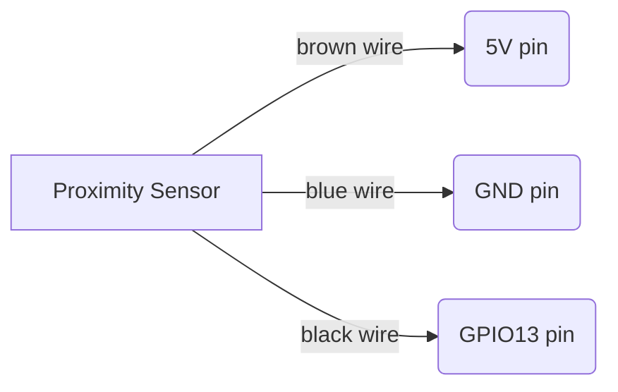
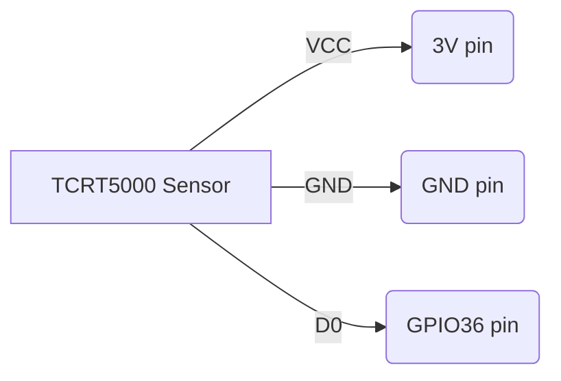

# Build a cheap water and gas usage sensor using ESPhome, a proximity sensor and a TCRT5000 Infrared Reflective Sensor and integrate it into Home Assistant

In this project I share a walkthrough on how you can build a water and gas usage meter using ESPHome that integrates with your Home Assistant.

## How to read an analog water meter?
I live in Belgium and the water meter I have is a Sensus 520 which has a small spinning wheel with a metal plate.


The solution to read it was by using either a reflective sensor or a proximity sensor.

The implemenation I went for was a proximity sensor [LJ18A3-8-Z/BX-5V](https://nl.aliexpress.com/item/32826218456.html)<br>


1 spin of the wheel will result in a pulse, every pulse being equal to what has been defined by your meter.

Note: make sure to position the sensor a bit on the side of the wheel, so it only covers half the wheel. This ensures it measures the pulses. If you cover it completely, it will always detect the wheel and won't register any pulses. You can easily test it when you let some water flow and see the sensor light blinking.


## How to read an analog gas meter?
The gas meter I use has a reflective mirror on one of the fractional numbers of the meter.<br>
In my case it is located on the last number around the number 6.<br>
<br>
1 spin of the last rotary dial will result in 0.01 m³ of gas consumption.<br>
The reading of this spin is done with a [TCRT5000 Infrared Reflective Sensor](https://nl.aliexpress.com/item/32703689686.html)<br>
<br>
To mount it on the gas meter display I had a housing 3D printed: https://www.thingiverse.com/thing:3923960<br>
<br>

For the readability of the meter I have aligned is as you can see on the picture below, making sure the infrared and the phototransistor are well aligned with the rotary dial containing the small mirror.<br>
<br>
To finetune the TCRT5000 you adjust the potentiometer until the 2nd led light goes out. It will light up when the mirror passes by on the rotary dial. (of course best to have some gas consumption ongoing while adjusting ;-))
## ESP32 board
As ESP32 board I used an [AZDelivery ESP32 Dev Kit C V4 board](https://www.amazon.com.be/-/nl/AZDelivery-ESP-32-compatibel-Arduino-inclusief/dp/B07Z83H831/)<br>


* The TCRT5000 runs on 3V
* The proximity sensor runs on 5V




# ESPHome
The code I have added will make your sensors available for integration into [Home Assistant](https://www.home-assistant.io/)

>* energy-meter.yaml : the main sensor configuration<br>
>* common/base.yaml : time configuration<br>
>* common/base_global.yaml : some other global esphome code I use for all my devices

# Home Assistant
1. In your configuration.yaml file, add the following:
```
utility_meter:
  water:
    source: sensor.water_used
  util_water_usage_quarter_hourly:
    source: sensor.water_used
    cycle: quarter-hourly
  util_water_usage_hourly:
    source: sensor.water_used
    cycle: hourly
  util_water_usage_daily:
    source: sensor.water_used
    cycle: daily
  util_water_usage_monthly:
    source: sensor.water_used
    cycle: monthly
  util_water_usage_yearly:
    source: sensor.water_used
    cycle: yearly
  gas:
    source: sensor.gas_used
  util_gas_usage_quarter_hourly:
    source: sensor.gas_used
    cycle: quarter-hourly
  util_gas_usage_hourly:
    source: sensor.gas_used
    cycle: hourly
  util_gas_usage_daily:
    source: sensor.gas_used
    cycle: daily
  util_gas_usage_monthly:
    source: sensor.gas_used
    cycle: monthly
  util_gas_usage_yearly:
    source: sensor.gas_used
    cycle: yearly
```
2. Reboot Home Assistant
3. Go to your Settings > Dashboards > Energy
4. Add your gas and water sensor to the dashbaord
   * sensor.water_used
   * sensor.gas_used<br>

5. Give Home Assistant a couple of hours and it will show you the data in the Energy Dashboard

## Calibrate the meters
As we have added the gas and water meter in the Utility Meters, we can also set their display values.<br>
This can be done by calling the calibrate service:<br>


This will show the meter values in HA as they are on your physical meters!<br>
<br>
```
type: vertical-stack
cards:
  - square: false
    columns: 2
    type: grid
    cards:
      - type: entity
        entity: sensor.gas
      - type: entity
        entity: sensor.water
  - type: energy-date-selection
  - type: energy-gas-graph
    title: Gas
  - type: energy-water-graph
    title: Water
```
