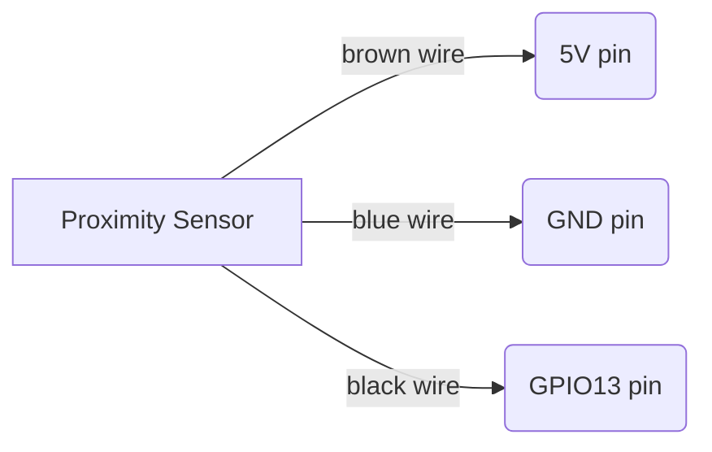
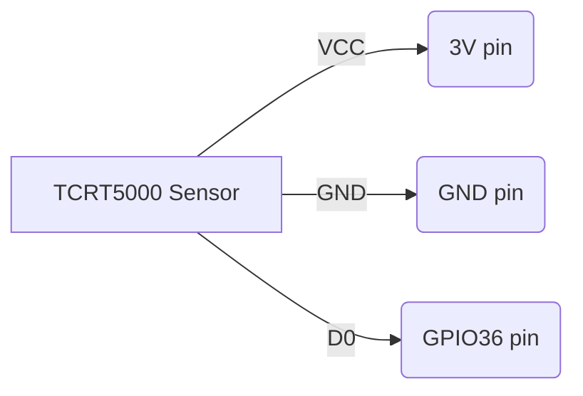

# Build a cheap water and gas usage sensor using ESPhome, a proximity sensor and a TCRT5000 Infrared Reflective Sensor

In this project I share a walkthrough on how you can build a water and gas usage meter using ESPHome that integrates with your Home Assistant.

## How to read an analog water meter?
I live in Belgium and the water meter I have is a Sensus 520 which has a small spinning wheel with a metal plate.

The solution to read it was by using either a reflective sensor or a proximity sensor.

The implemenation I went for was a proximity sensor [LJ18A3-8-Z/BX-5V](https://nl.aliexpress.com/item/32826218456.html) 

1 spin of the wheel will result in a pulse, every pulse being equal to what has been defined by your meter.

## How to read an analog gas meter?
The gas meter I use has a reflective mirror on one of the fractional numbers of the meter. 
In my case it is located on the last number around the number 6. 
 
1 spin of the last rotary dial will result in 0.001 m³ of gas consumption. 
The reading of this spin is done with a [TCRT5000 Infrared Reflective Sensor](https://nl.aliexpress.com/item/32826218456.html) 
 
To mount it on the gas meter display I had a housing 3D printed: https://www.thingiverse.com/thing:3923960 
 

For the readability of the meter I have aligned is as you can see on the picture below, making sure the infrared and the phototransistor are well aligned with the rotary dial containing the small mirror. 
 
To finetune the TCRT5000 you adjust the potentiometer until the 2nd led light goes out. It will light up when the mirror passes by on the rotary dial. (of course best to have some gas consumption ongoing while adjusting ;-))
## ESP32 board
As ESP32 board I used an [AZDelivery ESP32 Dev Kit C V4 board](https://www.amazon.com.be/-/nl/AZDelivery-ESP-32-compatibel-Arduino-inclusief/dp/B07Z83H831/) 

* The TCRT5000 runs on 3V
* The proximity sensor runs on 5V

# ESPHome
The code I have added will make your sensors available for integration into [Home Assistant](https://www.home-assistant.io/)
